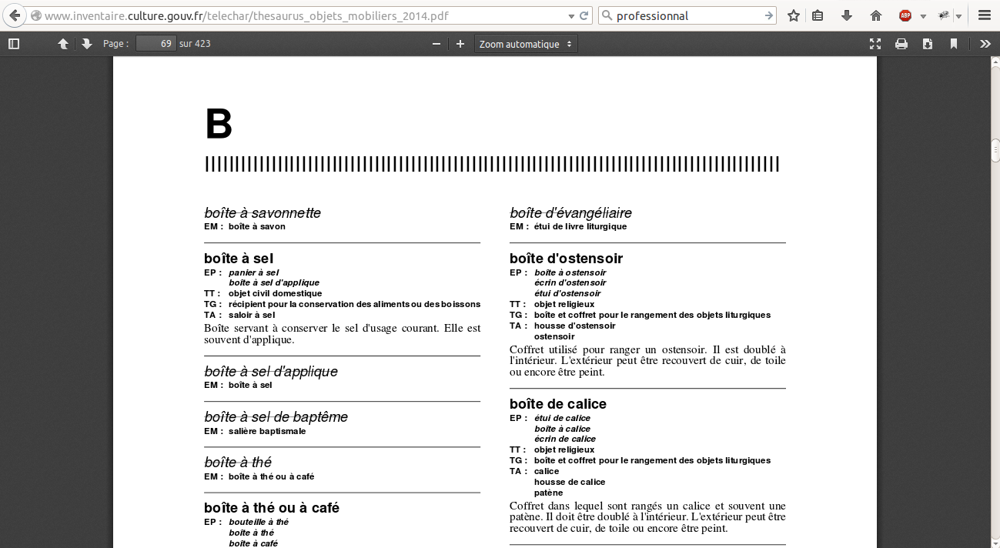
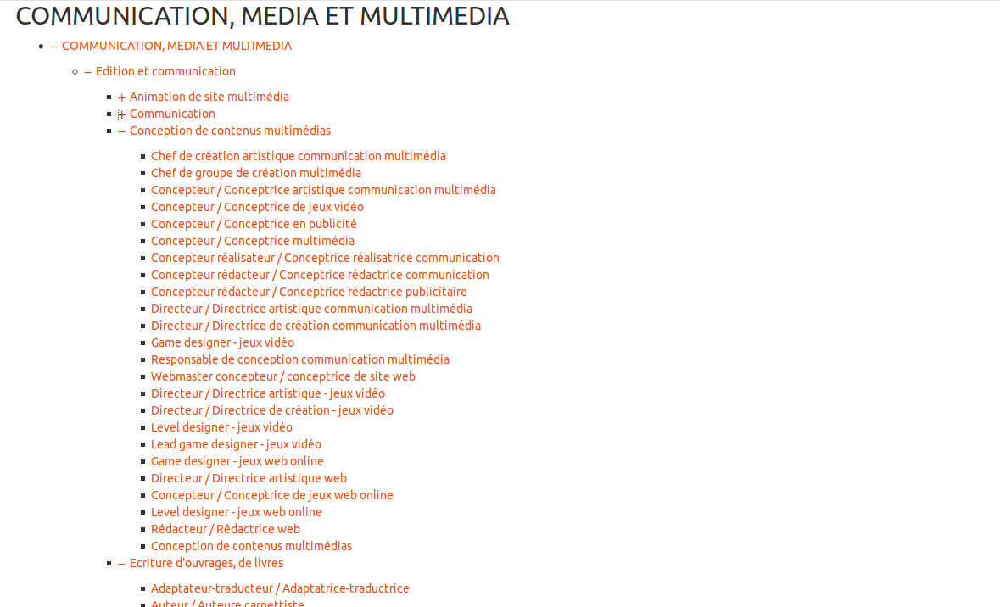
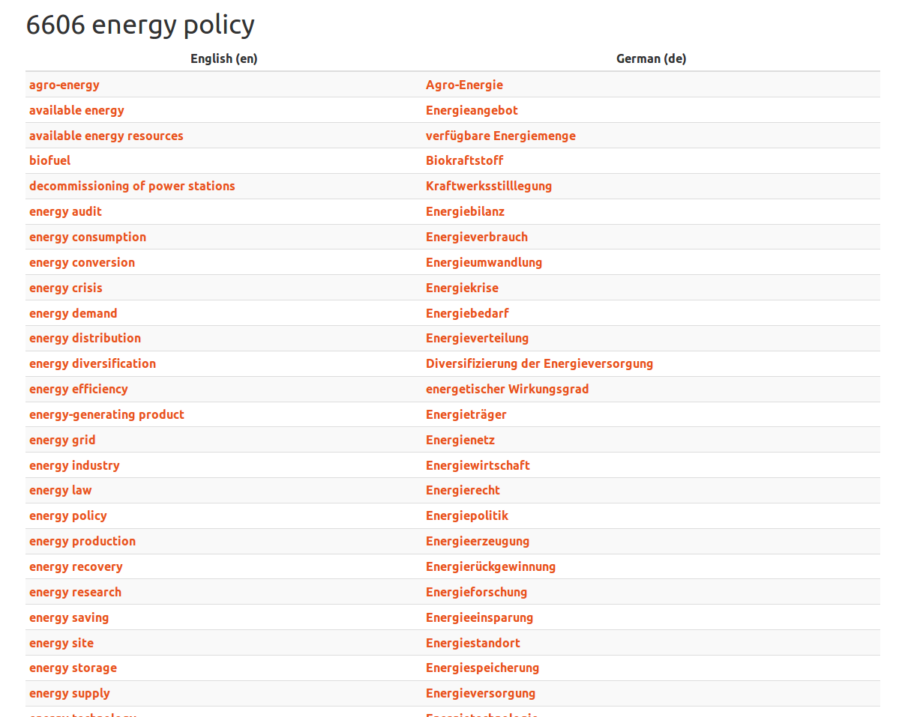
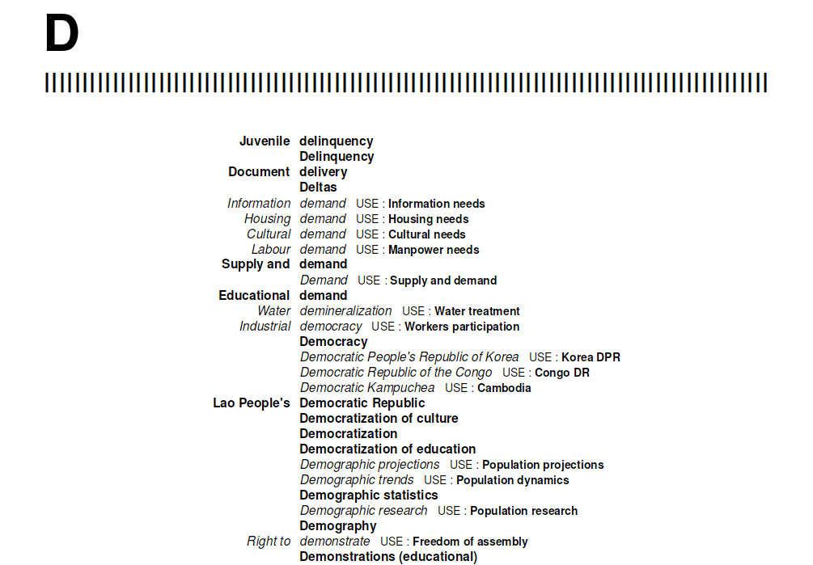
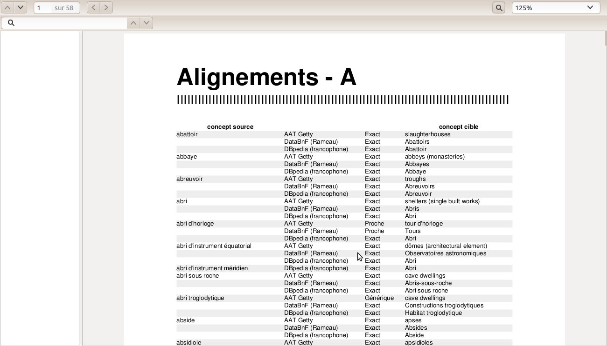
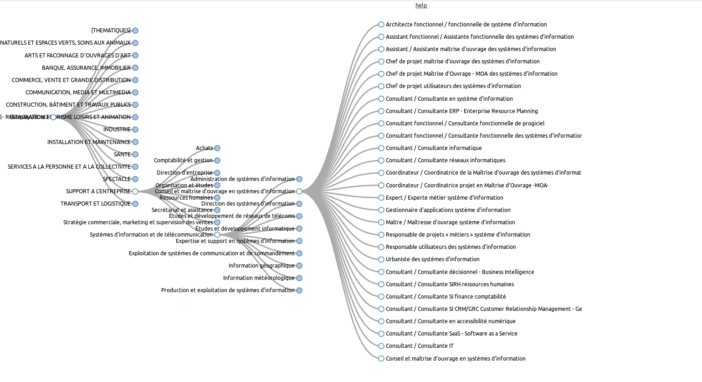
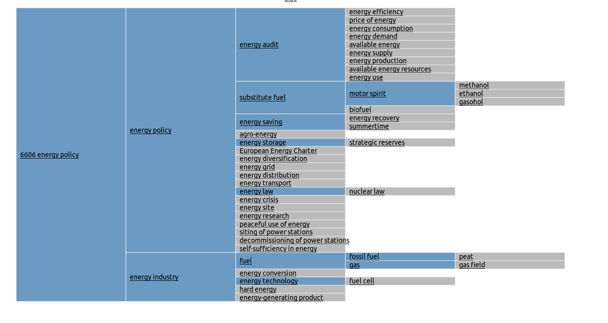
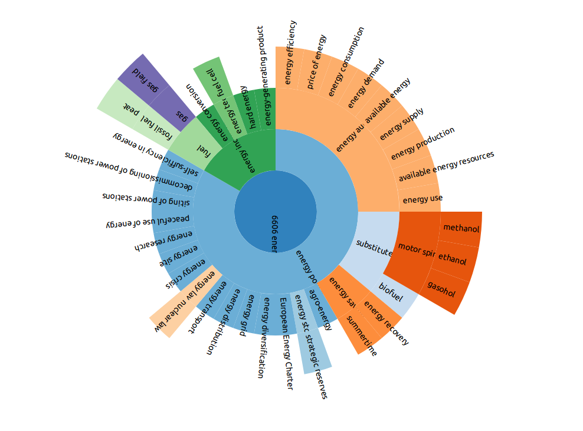
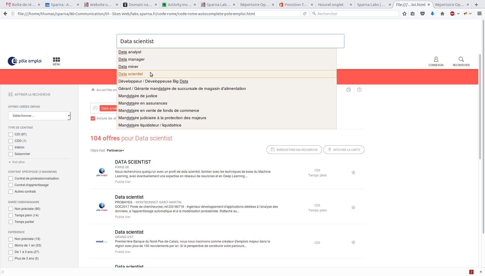
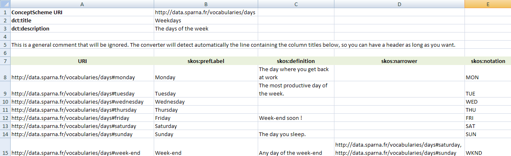

# SKOS Play!

SKOS Play is a free application to work with thesaurus or classification expressed in [SKOS](https://www.w3.org/TR/2009/REC-skos-reference-20090818/).

SKOS Play! is live at **https://labs.sparna.fr/skos-play/**

With SKOS Play you can :
  1. Print / visualize thesaurus
  2. Convert Excel tables to SKOS
  3. Validate SKOS files

### Print / visualize thesaurus

The core feature of SKOS Play is the ability to render SKOS data in various ways.

#### Generate different outputs

SKOS Play can print your thesaurus in various ways :

##### Alphabetical indexes

##### Hierarchical trees (static or unfoldable)

##### Translation tables

##### Permuted / KWIC indexes

##### Alignment tables

#### Generate PDF files

SKOS Play can also be used to produce printable PDFs from your thesaurus, with the same kind of outputs as the ones described above. PDFs are clickable so you can navigate the content of your thesaurus within the PDF.

#### Cool dataviz with D3JS

SKOS Play leverages D3js to display the hierarchy of the SKOS structure in nice ways :

##### Tree visualization

##### Square visualization

##### Circle visualization

##### Autocomplete field

SKOS Play also illustrates the generation of an autocomplete form filled with your thesaurus labels :

#### Works with OWL ontologies too !

By the way, SKOS Play also works with [OWL or RDFS ontologies](https://www.w3.org/TR/owl2-overview/) by converting them into SKOS, so you can print cool ontologies like CIDOC-CRM, schema.org, etc.

### Create SKOS classifications from Excel / Google spreadsheets

The [SKOS Play converter](https://labs.sparna.fr/skos-play/convert) is a tool to easily maintain classifications in Excel and turn them into SKOS, following a simple file template, with specific column headers.

The converter is also integrated with Google Spreadsheets, so you can even maintain your classification collaboratively, and turn it directly into SKOS !

### Validated SKOS data

SKOS Play includes a frontend for the qSKOS validator, hosted in a separate project : [SKOS-testing-tool](https://github.com/sparna-git/skos-testing-tool).

## Who is using SKOS Play ?
  - French Ministry of Culture
  - UNESCO
  - Heritage Data
  - Reegle thesaurus
  - Service Central de Legislation du Luxembourg

_(want to be listed here ? [contact us](http://www.sparna.fr/contact) !)_

## Contribution guidelines

* If you spot a problem, need a specific feature, or want to open a discussion please [file an issue](https://github.com/sparna-git/skos-play/issues).
* You can also use the [SKOS Play mailing list](https://groups.google.com/forum/#!forum/skos-play-discuss)

## Who are we ?

*  [SKOS Play](https://labs.sparna.fr/skos-play/) is developped by Thomas Francart in his company [Sparna](http://www.sparna.fr/contact)
*  You can read more about SKOS Play on [blog.sparna.fr](http://blog.sparna.fr)
